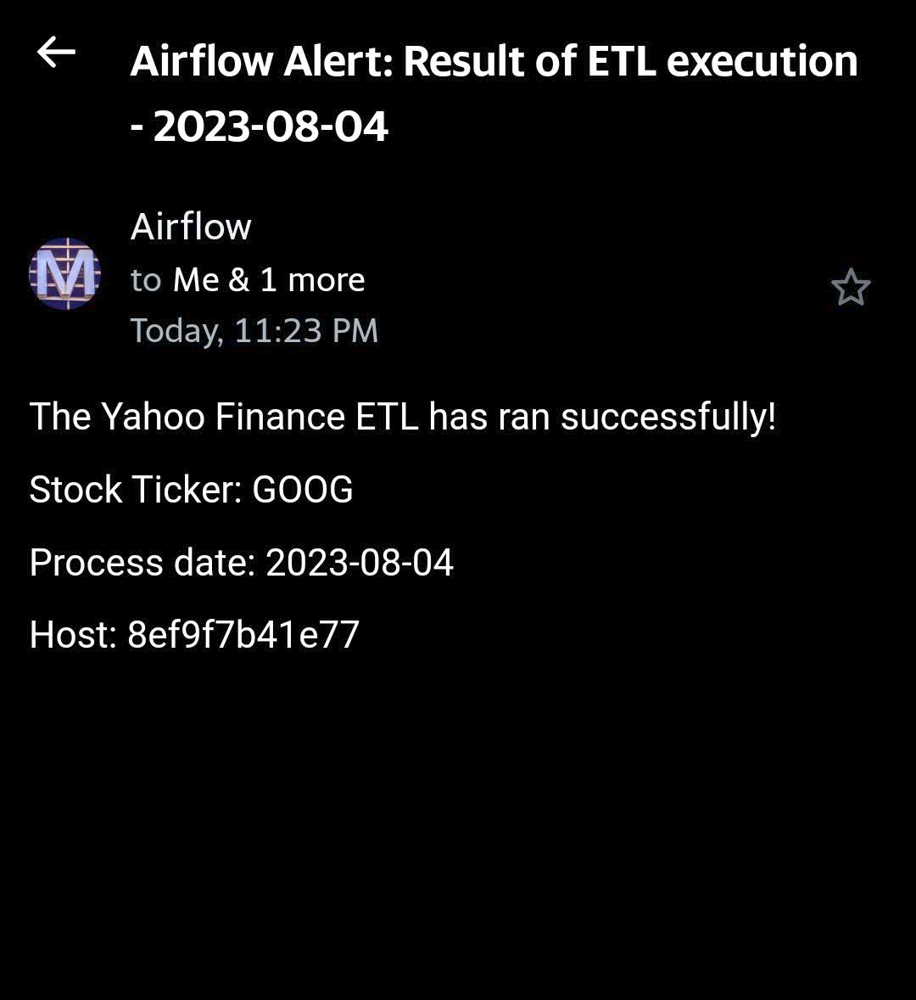
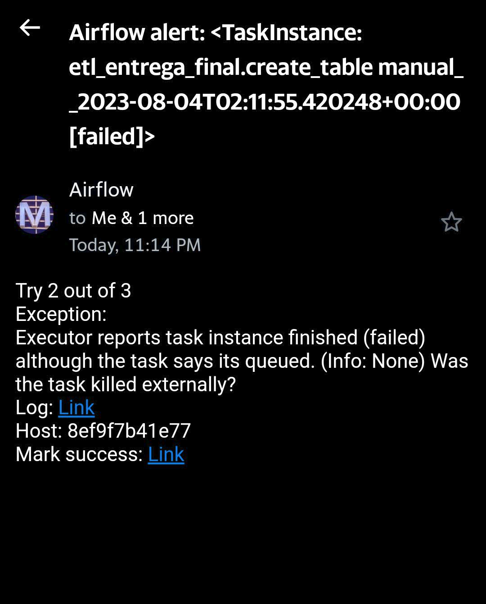
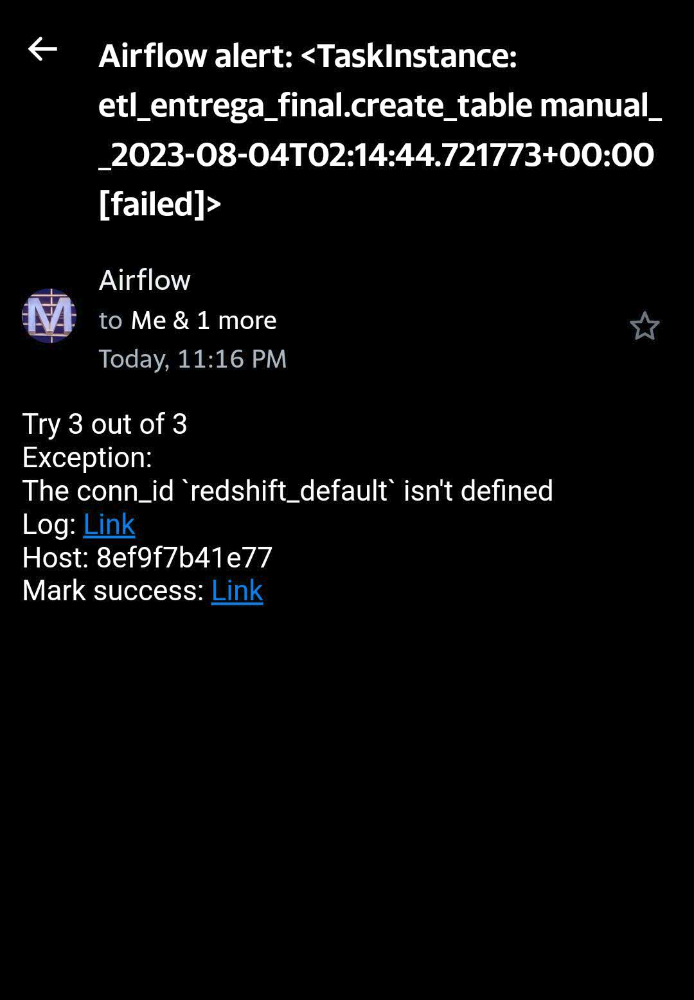

# Entregable 3


# Distribución de los archivos
Los archivos a tener en cuenta son:
* `docker_images/`: Contiene los Dockerfiles para crear las imagenes utilizadas de Airflow y Spark.  
* `docker-compose.yaml`: Archivo de configuración de Docker Compose. Contiene la configuración de los servicios de Airflow y Spark.
* `.env`: Archivo de variables de entorno. Contiene variables de conexión a Redshift y driver de Postgres.
* `dags/`: Carpeta con los archivos de los DAGs.
    * `etl_entrega_final.py`: DAG principal que ejecuta el pipeline de extracción, transformación y carga de datos de Yahoo Finance.
* `logs/`: Carpeta con los archivos de logs de Airflow.
* `plugins/`: Carpeta con los plugins de Airflow.
* `postgres_data/`: Carpeta con los datos de Postgres.
* `scripts/`: Carpeta con los scripts de Spark.
    * `postgresql-42.5.2.jar`: Driver de Postgres para Spark.
    * `commons.py`: Script de Spark con funciones comunes.
    * `ETL_Entregable3.py`: Script de Spark que ejecuta el ETL.
* `config/`: Carpeta con el archivo de configuracion de airflow (airflow.cfg).


# Pasos para ejecutar el ETL
1. Posicionarse en la carpeta `entregable_3`. A esta altura debería ver el archivo `docker-compose.yaml`.

2. Crear las siguientes carpetas a la misma altura del `docker-compose.yaml`.
```bash
mkdir -p logs plugins postgres_data
```
3. Crear un archivo con variables de entorno llamado `.env` ubicado a la misma altura que el `docker-compose.yaml`. Cuyo contenido sea:
```bash
### parametros para ejecutar el DAG
PARAM_TICKER_EMPRESA='GOOG'
PARAM_PROCESS_DATE="2023-07-28"
PARAM_RETRIES=3
PARAM_RETRY_DELAY=1 #(minutos)
PARAM_EMAIL_TO_1='xxxxx@gmail.com'
PARAM_EMAIL_TO_2='xxxxx@yahoo.com'

### parametros de configuracion
DRIVER_PATH='/tmp/drivers'

### parametros de conexion a la base
REDSHIFT_HOST=...
REDSHIFT_PORT=5439
REDSHIFT_DB=...
REDSHIFT_USER=...
REDSHIFT_SCHEMA=...
REDSHIFT_PASSWORD=...
REDSHIFT_URL="jdbc:postgresql://${REDSHIFT_HOST}:${REDSHIFT_PORT}/${REDSHIFT_DB}?user=${REDSHIFT_USER}&password=${REDSHIFT_PASSWORD}"
DRIVER_PATH=/tmp/drivers/postgresql-42.5.2.jar
REDSHIFT_TABLE='entrega_final'
```
4. Generar las imagenes de Airflow y Spark. Las imagenes fueron generadas a partir de las imagenes del repositorio de Lucas. A la imagen de airflow le agregue la librelia de yfinance para poder trabajar con la api.

```bash
sudo docker build -t lucastrubiano/airflow:airflow_2_6_2_yfinance docker_images/airflow/.
sudo docker build -t lucastrubiano/spark:spark_3_4_1 docker_images/spark/.
```
5. Ejecutar el siguiente comando para levantar los servicios de Airflow y Spark.
```bash
sudo docker-compose up --build
```
6. Una vez que los servicios estén levantados, ingresar a Airflow en `http://localhost:8080/`.

7. En la pestaña `Admin -> Connections` crear una nueva conexión con los siguientes datos para Redshift:
    * Conn Id: `redshift_default`
    * Conn Type: `Amazon Redshift`
    * Host: `host de redshift`
    * Database: `base de datos de redshift`
    * Schema: `esquema de redshift`
    * User: `usuario de redshift`
    * Password: `contraseña de redshift`
    * Port: `5439`

8. En la pestaña `Admin -> Connections` crear una nueva conexión con los siguientes datos para Spark:
    * Conn Id: `spark_default`
    * Conn Type: `Spark`
    * Host: `spark://spark`
    * Port: `7077`
    * Extra: `{"queue": "default"}`

9. En la pestaña `Admin -> Variables` crear una nueva variable con los siguientes datos:
    * Key: `driver_class_path`
    * Value: `/tmp/drivers/postgresql-42.5.2.jar`

10. En la pestaña `Admin -> Variables` crear una nueva variable con los siguientes datos:
    * Key: `spark_scripts_dir`
    * Value: `/opt/airflow/scripts`

11. Modificar el archivo airflow.cfg que esta en la carpeta config y completar los datos de la seccion [smtp] con los valores correspondientes.
```bash
smtp_host = smtp.gmail.com
smtp_starttls = True
smtp_ssl = False
smtp_user = user@gmail.com
smtp_password = ********
smtp_port = 587
smtp_mail_from = airflow@example.com
smtp_timeout = 30
smtp_retry_limit = 5
```

13. Ejecutar el DAG `etl_entrega_final`.

```
En esta última entrega se agrega el envío de alertas por email.
Se envían notificaciones por: 

Tarea finalizada exitosamente...
```

```
Reintentos de ejecución... 
```

```
Tarea finalizada con error...
```


```
Se agregaron también parámetros y umbrales de ejecución.

```

